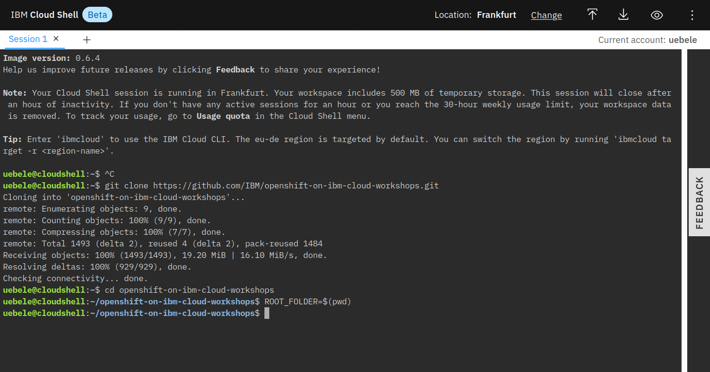
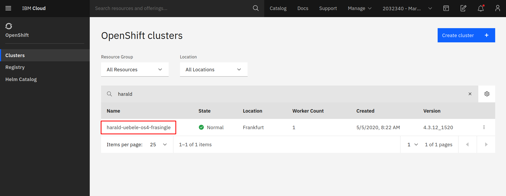
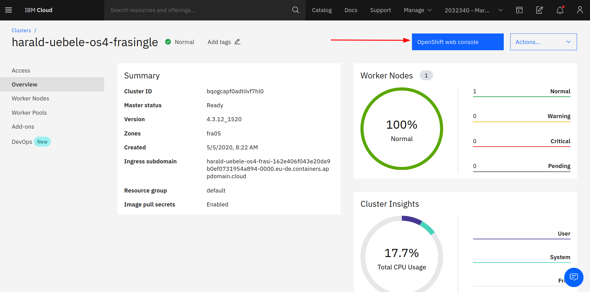
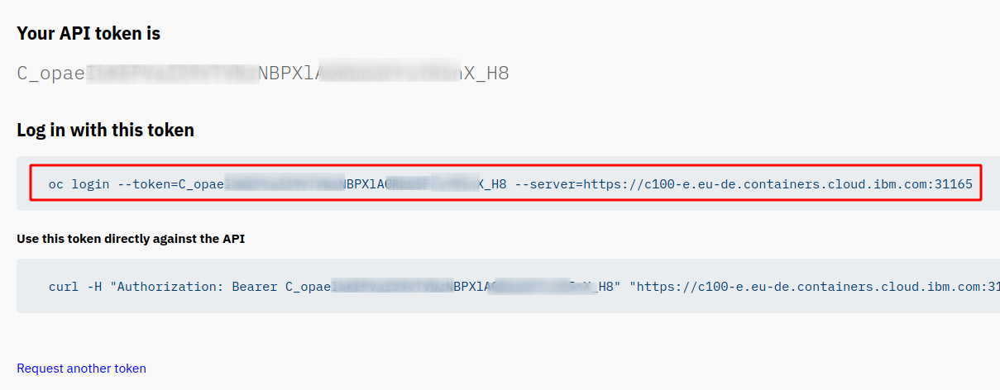

# Prerequisties

## Overview 

An [IBM Cloud account](https://cloud.ibm.com/registration) is needed. 

We will use preconfigured [OpenShift on IBM Cloud](https://cloud.ibm.com/kubernetes/catalog/openshiftcluster) clusters in this hands-on workshop. You should have received information from your lab instructor to get access to one of these clusters.


## 1. Work Environment

For the **optional Java developer labs 2 and 3** you need a local `docker` and `git` installation.

For the rest of the labs we will use the IBM Cloud Shell (Beta):


1. In your browser, login to the [IBM Cloud](https://cloud.ibm.com) Dashboard
2. Make sure you select **your own account** in the account list, then click on the IBM Cloud Shell Icon

   

    Note: Your workspace includes 500 MB of temporary storage. This session will close after an hour of inactivity. If you don't have any active sessions for an hour or you reach the 30-hour weekly usage limit, your workspace data is removed. To track your usage, go to Usage quota in the Cloud Shell menu.

   


## 2. Get the code

In the IBM Cloud Shell execute the following commands:

```
$ git clone https://github.com/IBM/openshift-on-ibm-cloud-workshops.git
$ cd openshift-on-ibm-cloud-workshops
$ ROOT_FOLDER=$(pwd)
```


## 3. Get Access to OpenShift on the IBM Cloud

### a. Open the OpenShift console. 

1. Go back to the IBM Cloud Dashboard (https://cloud.ibm.com).

2. Switch from your **own** account to the **IBM account** given to you by the instructor from the pulldown in the uper right corner.

3. Select **OpenShift -> Clusters** in the 'burger' menu

    

4. Click on your **OpenShift cluster**

    

4. Open the **OpenShift web console**

    

### b. Get the access token for the 'oc' CLI. 


1. From the dropdown menu in the upper right of the page, click 'Copy Login Command'. 

    

1. Click on 'Display Token', then copy and paste the command 'Log in with this token' into your terminal in the IBM Cloud Shell.

    

1. Login to OpenShift in IBM Cloud Shell

    ```
    $ oc login https://c1XX-XX-X.containers.cloud.ibm.com:XXXXX --token=xxxxxx'
    ```

    

---

__Continue with [Lab 4 - Deploying to OpenShift](4-openshift.md)__

