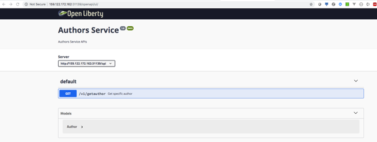
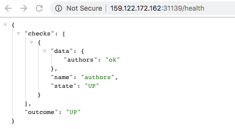

# 5.Kubernetes deployment configuration

Now we examine the **deployment** and **service** yaml. The yamls do contain the deployment of the container to a **Pod** and creation of the **Services** to access the **Authors mircoservice** in the Kubernetes Cluster. 

In the following image we see the relevant dependencies for this lab.


## 5.1 Deployment

The deployment will deploy the container to a Pod in Kubernetes.
For more details we use the [Kubernetes documentation](https://kubernetes.io/docs/concepts/workloads/pods/pod-overview/) for Pods.

> A Pod is the basic building block of Kubernetes–the smallest and simplest unit in the Kubernetes object model that you create or deploy. A Pod represents processes running on your Cluster .


Let's start with the **deployment yaml**. For more details we use will the [Kubernetes documentation](https://kubernetes.io/docs/concepts/workloads/controllers/deployment/) for deployments.

Definition of the ```kind``` defines this is a ```Deployment``` configuration.

```yml
kind: Deployment
apiVersion: apps/v1beta1
metadata:
  name: authors
```

Inside the ```spec``` section, we give the deployment a app name and version label.

```yml
spec:
  ...
  template:
    metadata:
      labels:
        app: authors
        version: v1
```

Then we define a ```name``` for the container and we provide the concret container ```image``` location, e.g. where the container can be found in the **Container Registry**. 

_NOTE:_ We will replace ```authors:1``` later with the IBM Container Registry information. 

The ```containerPort``` depends on the port definition inside our **Dockerfile** or better in our **server.xml**.

Now we should remember the usage of **HealthEndpoint** class for our **Authors**, here we see the ```livenessProbe``` definition.


```yml
spec:
      containers:
      - name: authors
        image: authors:1
        ports:
        - containerPort: 3000
        livenessProbe:
```

This is the full [deployment.yaml](../authors-java-jee/deployment/deployment.yaml) file.

```yaml
kind: Deployment
apiVersion: apps/v1beta1
metadata:
  name: authors
spec:
  replicas: 1
  template:
    metadata:
      labels:
        app: authors
        version: v1
    spec:
      containers:
      - name: authors
        image: authors:1
        ports:
        - containerPort: 3000
        livenessProbe:
          exec:
            command: ["sh", "-c", "curl -s http://localhost:3000/"]
          initialDelaySeconds: 20
        readinessProbe:
          exec:
            command: ["sh", "-c", "curl -s http://localhost:3000/health | grep -q authors"]
          initialDelaySeconds: 40
      restartPolicy: Always
```
## 5.2 Service

After the definition of the **Pod** we need to define how to access the Pod, therefor we use a **service** in Kubernetes. For more details we use the [Kubernetes documentation](https://kubernetes.io/docs/concepts/services-networking/service/) for service.

> A Kubernetes Service is an abstraction which defines a logical set of Pods and a policy by which to access them - sometimes called a micro-service. The set of Pods targeted by a Service is (usually) determined by a Label Selector.

In the service we map the **NodePort** of the cluster to the port 3000 of the **Authors** service running in the **authors** Pod, as we can see in the following picture. 

_Note:_ Later we get the actual port for the service using the command line: ```nodeport=$(kubectl get svc authors --ignore-not-found --output 'jsonpath={.spec.ports[*].nodePort}')```.


In the [service.yaml](../authors-java-jee/deployment/service.yaml) we find our selector to the Pod **authors**. If the service is deployed, it is possible that our **Articles** service can find the **Authors** service.

```yaml
kind: Service
apiVersion: v1
metadata:
  name: authors
  labels:
    app: authors
spec:
  selector:
    app: authors
  ports:
    - port: 3000
      name: http
  type: NodePort
---
```

# 5. Hands-on tasks - Replace the Node.js Authors microservice with a simple Java implementation

### 2.1 Gain access to your cluster

1. Log in to your IBM Cloud account. Include the --sso option if using a federated ID.

    ```sh
    $ ibmcloud login -a https://cloud.ibm.com -r us-south -g default
    ```

2. Download the kubeconfig files for your cluster.

    ```sh
    $ ibmcloud ks cluster-config --cluster cloud-native
    ```

3. Set the KUBECONFIG environment variable. Copy the output from the previous command and paste it in your terminal. The command output looks similar to the following example:

    ```sh
    $ export KUBECONFIG=/Users/$USER/.bluemix/plugins/container-service/clusters/cloud-native/kube-config-mil01-cloud-native.yml
    ```

4. Verify you can connect to your cluster by listing your worker nodes.

    ```sh
    $ kubectl get nodes
    ```

5. Ensure you have no remaining microservices running from the other labs in this workshop.

    ```sh
    $ scripts/delete-all.sh
    ```

6. Verify the delete with following commands.

    ```sh
    $ kubectl get pods
    $ kubectl get services  
    ```

### 2.1 Build the container and upload to the IBM Container Registry

1. Logon to the IBM Cloud Container Registry 

    ```sh
    $ cd authors-java-jee
    $ ibmcloud cr login
    ```

2. List you namespaces inside the IBM Cloud Container Registry 

    ```sh
    $ ibmcloud cr namespaces
    ```

    _Sample result outout:_

    ```sh
    $ Listing namespaces for account 'Thomas Südbröcker's Account' in registry 'de.icr.io'...
    $
    $ Namespace   
    $ cloud-native
    ```

3. Now upload the code and build the container image inside IBM Cloud Container Registry. We use the upper information we got from listing the namespaces.

    ```sh
    $ ibmcloud cr build -f Dockerfile --tag $REGISTRY/$REGISTRY_NAMESPACE/authors:2 .
    ```

    _Sample result values:_

    ```sh
    $ ibmcloud cr build -f Dockerfile --tag de.icr.io/cloud-native/authors:2 .
    ```

    _Optional:_ Verify the container upload in the IBM Cloud web UI.

    

4. List the container images to verify the upload.

    ```sh
    $ ibmcloud cr images
    ```

    _Sample result output:_

    ```sh
    $ REPOSITORY                        TAG   DIGEST         NAMESPACE      CREATED          SIZE     SECURITY STATUS   
    $ de.icr.io/cloud-native/articles   1     b5dc1f96a69a   cloud-native   1 day ago        273 MB   7 Issues   
    $ de.icr.io/cloud-native/authors    2     217b7716dce1   cloud-native   30 seconds ago   259 MB   7 Issues   
    ```

    Copy the REPOSITORY path for the uploaded **Authors** container image.
    In this case sample: ```de.icr.io/cloud-native/authors```

### 2.3 Deploy the container image

1. Open the ```../authors-java-jee/deployment/deployment.yaml```with a editor and replace the value for the image location with the path we got from the IBM Container Registry and just replace the ```authors:1``` text, and add following statement ```imagePullPolicy: Always``` and **save** the file.

    Before:
    ```yml
    image: authors:1
    ```

    Sample change:
    ```yml
    image: de.icr.io/cloud-native/authors:2
    imagePullPolicy: Always
    ```

2. Now we apply the deployment we will create the new **Authors** Pod.

    ```sh
    $ kubectl apply -f deployment/deployment.yaml
    ```

3. Now we apply the service we will create the new **Authors** Service.

    ```sh
    $ kubectl apply -f deployment/service.yaml
    ```

4. Get cluster (node) IP address

    ```sh
    $ clusterip=$(ibmcloud ks workers --cluster cloud-native | awk '/Ready/ {print $2;exit;}')
    $ echo $clusterip
    $ 159.122.172.162
    ```

5. Get nodeport.

    ```sh
    $ nodeport=$(kubectl get svc authors --ignore-not-found --output 'jsonpath={.spec.ports[*].nodePort}')
    $ echo $nodeport
    $ 30108
    ```

5. Open API explorer.

    ```sh
    $ open http://${clusterip}:${nodeport}/openapi/ui/
    ```

    Sample result in your browser:

    


6. Execute curl to test the **Authors** service.

    ```sh
    $ curl http://${clusterip}:${nodeport}/api/v1/getauthor?name=Niklas%20Heidloff
    ```

    Sample result:
    ```
    $ {"name":"Niklas Heidloff","twitter":"@nheidloff","blog":"http://heidloff.net"}
    ```

7. Execute following curl command to test the **HealthCheck** implementation for the **Authors** service.

    ```sh
    $ curl http://${clusterip}:${nodeport}/health
    $ {"checks":[{"data":{"authors":"ok"},"name":"authors","state":"UP"}],"outcome":"UP"} 
    ```

    Optional: We can also verify that call in the browser.

    

---

Now, we've finished the **Replace the Node.js Authors microservice with a simple Java implementation**.

**Congratulations** :thumbsup: and **greatest respect** :muscle:, you did the **extra mile** and you have finished this **hands-on workshop + optional lab** :-).

---

Resources:

* ['Simplest possible Microservice in Java'](../authors-java-jee/README.md)
* ['How to deploy a container to the IBM Cloud Kubernetes Service](https://suedbroecker.net/2019/03/05/how-to-deploy-a-container-to-the-ibm-cloud-kubernetes-service/)