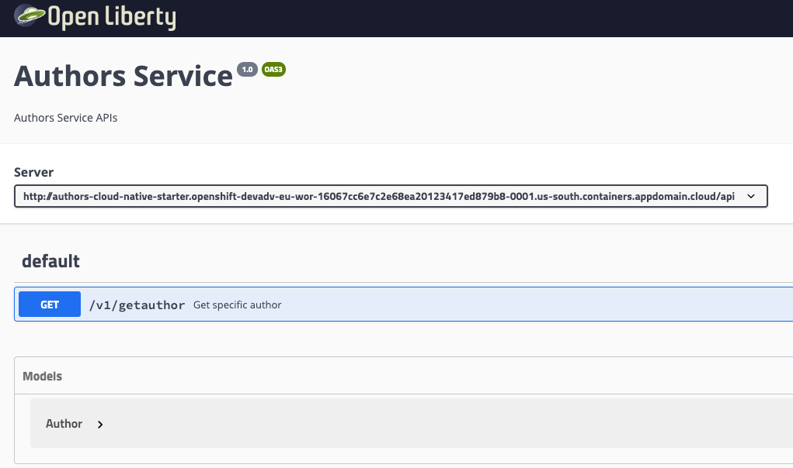

# Lab 2 - Running the Java Microservice locally

In this workshop we create a microservice that has been implemented with Java EE and [Eclipse MicroProfile](https://microprofile.io/).

The microservice has been kept as simple as possible, so that it can be used as a starting point for other microservices. It contains the following functionality:

* Image with OpenJ9, OpenJDK, Open Liberty and MicroProfile: [Dockerfile](../Dockerfile)
* Maven project: [pom.xml](../pom.xml)
* Open Liberty server configuration: [server.xml](../liberty/server.xml)
* Health endpoint: [HealthEndpoint.java](../src/main/java/com/ibm/authors/HealthEndpoint.java)
* Kubernetes yaml files: [deployment.yaml](../deployment/deployment.yaml) and [service.yaml](../deployment/service.yaml)
* Sample REST GET endpoint: [AuthorsApplication.java](../src/main/java/com/ibm/authors/AuthorsApplication.java), [GetAuthor.java](../src/main/java/com/ibm/authors/GetAuthor.java) and [Author.java](../src/main/java/com/ibm/authors/Author.java)

This service provides a REST API 'getauthor'. Normally we would use a database but in this example we just simulate with local sample data. With this small example we touch the following topics:

* Usage of [Maven](https://maven.apache.org/) for Java 
* Configuration of an [OpenLiberty Server](https://openliberty.io)
* Implementation of a [REST GET endpoint with MicroProfile](https://openliberty.io/blog/2018/01/31/mpRestClient.html)
* [Health check](https://openliberty.io/guides/kubernetes-microprofile-health.html#adding-a-health-check-to-the-inventory-microservice) implementation using a MicroProfile for Kubernetes 
* Definition of a [Dockerfile](https://docs.docker.com/engine/reference/builder/) with the reuse for existing containers from [Dockerhub](https://hub.docker.com)

## Definition of the Image

For the image we use a stack of open source components to run the Java microservice on Open Liberty.

* OpenJ9 0.12.1
* OpenJDK 8u202-b08 from AdoptOpenJDK
* Open Liberty 18.0.0.4
* MicroProfile 2.1

Read the article [How to build and run a Hello World Java Microservice](http://heidloff.net/article/how-to-build-and-run-a-hello-world-java-microservice/) to learn more.

In the [Dockerfile](authors-java-jee/Dockerfile) we define how to build the container image. For detailed information check the [Dockerfile documentation](https://docs.docker.com/engine/reference/builder/)

When we build a new container image we usually start with an existing container image that already contains a minimum of the configuration we need, for example the OS, the Java version or even more. For this we search [DockerHub](https://hub.docker.com/search?q=maven&type=image&image_filter=official) or on the internet to find a starting point which fits to our needs. 

Inside of our Dockerfile we use two stages to build the container image. The reason for the two stages is that we want to be independend of an existing local environment when we build our production services. With this concept we don't have to ensure that e.g. Java and Maven or correct versions of them are installed on the local machine of the developers.

With this two stage approach there is one container responsible to build the microservice, let us call this container build environment container, and another container will contain the microservice itself, we call this the production container. Only this production container is later used.


### Build environment container

In the following Dockerfile sample we can see how we create our build environment container based on the maven 3.5 image from [DockerHub](https://hub.docker.com/_/maven/).

We use the pom file that we defined before to build our Authors service with `RUN mvn -f /usr/src/app/pom.xml clean package`.

```dockerfile
FROM maven:3.5-jdk-8 as BUILD
 
COPY src /usr/src/app/src
COPY pom.xml /usr/src/app
RUN mvn -f /usr/src/app/pom.xml clean package
```

### Production container

The starting point for the Production container is an [OpenLiberty container](https://hub.docker.com/_/open-liberty).

We copy the Authors service code together with the server.xml for the OpenLiberty server to this container.

_REMEMBER:_ The service.xml contains the ports we use for our Authors service.

```dockerfile
FROM openliberty/open-liberty:microProfile2-java8-openj9 

COPY liberty/server.xml /config/
COPY --from=BUILD /usr/src/app/target/authors.war /config/apps/
```

## Run the Container locally

_Note_: Here are some additional instructions based on your choosen setup.

### [Tools - Option 1](./1-prereqs.md#tools---option-1-prebuilt-image-with-local-code)

#### Step 1: You need to open a new local terminal 

#### Step 2: Navigate to your local project folder ```openshift-on-ibm-cloud-workshops/2-deploying-to-openshift``` 

#### Step 3: [Move on with the lab](./2-docker.md#step-1-to-test-and-see-how-the-code-works-you-can-run-the-code-locally-as-a-docker-container).

### [Tools - Option 2](./1-prereqs.md#tools---option-2-prebuilt-image-with-code-in-container)

#### Step 1: You need to download or clone the project onto your local PC, first.

```
$ git clone https://github.com/nheidloff/openshift-on-ibm-cloud-workshops.git
```

#### Step 2: Open a new terminal and navigate tp your local project folder ```openshift-on-ibm-cloud-workshops/2-deploying-to-openshift``.

```
$ cd /openshift-on-ibm-cloud-workshops/2-deploying-to-openshift
```

#### Step 3: [Move on with the lab](./2-docker.md#step-1-to-test-and-see-how-the-code-works-you-can-run-the-code-locally-as-a-docker-container).


### Lab

### Step 1: To test and see how the code works you can run the code locally as a Docker container

```
$ cd ${ROOT_FOLDER}/2-deploying-to-openshift
$ docker build -t authors .
$ docker run -i --rm -p 3000:3000 authors
```

### Step 2: Open the Swagger UI of the mircoservice in a browser.

```
http://localhost:3000/openapi/ui/
```




---

__Continue with [Lab 3 - Understanding the Java Implementation](./3-java.md#lab-3---understanding-the-java-implementation)__