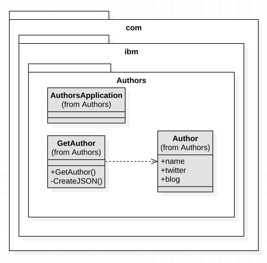
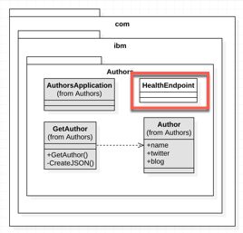

# Lab 3 - Understanding the Java Implementation


## 1. Usage of Maven for Java

We begin with the [Maven](https://maven.apache.org/) part for our Java project.

> Maven Apache Maven is a software project management and comprehension tool. Based on the concept of a **project object model** (POM), Maven can manage a project's build, reporting and documentation from a central piece of information.

In the pom file we define the configuration of our Java project with dependencies, build, and properties including the compiler information as you can see in the [pom file](../authors-java-jee/pom.xml) below.

```xml
<project xmlns="http://maven.apache.org/POM/4.0.0"
	xmlns:xsi="http://www.w3.org/2001/XMLSchema-instance"
	xsi:schemaLocation="http://maven.apache.org/POM/4.0.0 http://maven.apache.org/xsd/maven-4.0.0.xsd">
	<modelVersion>4.0.0</modelVersion>
	<groupId>com.ibm.cloud</groupId>
	<artifactId>authors</artifactId>
	<version>1.0-SNAPSHOT</version>
	<packaging>war</packaging>

	<dependencies>
		<dependency>
			<groupId>javax</groupId>
			<artifactId>javaee-api</artifactId>
			<version>8.0</version>
			<scope>provided</scope>
		</dependency>
		<dependency>
			<groupId>org.eclipse.microprofile</groupId>
			<artifactId>microprofile</artifactId>
			<version>2.1</version>
			<scope>provided</scope>
			<type>pom</type>
		</dependency>
	</dependencies>

	<build>
		<finalName>authors</finalName>
	</build>

	<properties>
		<maven.compiler.source>1.8</maven.compiler.source>
		<maven.compiler.target>1.8</maven.compiler.target>
		<failOnMissingWebXml>false</failOnMissingWebXml>
		<project.build.sourceEncoding>UTF-8</project.build.sourceEncoding>
	</properties>
</project>
```


## 2. Configuration the Open Liberty Server

Our Authors microservice will run on an OpenLiberty Server in a container on Kubernetes.

We need to configure the OpenLiberty server with a [server.xml](../authors-java-jee/liberty/server.xml) file. For our Java implementation we decided to use MicroProfile and within the feature definition in the server.xml we provide this information to our server with the entries `webProfile-8.0` and `microProfile-2.1`.
The server must be reached in the network. Therefore we define the  httpEndpoint including httpPort we use for our microservice. For configuration details take a look into the [openliberty documentation](https://openliberty.io/docs/ref/config/).

_IMPORTANT:_ We should remember that this port (`httpPort="3000"`) must be exposed in the Dockerfile for our container and mapped inside the Kubernetes deployment configuration.

Also the name of the executable web application is definied in the server.xml.

```xml
<?xml version="1.0" encoding="UTF-8"?>
<server description="OpenLiberty Server">
	
    <featureManager>
        <feature>webProfile-8.0</feature>
        <feature>microProfile-2.1</feature>
    </featureManager>

    <httpEndpoint id="defaultHttpEndpoint" host="*" httpPort="3000" httpsPort="9443"/>

    <webApplication location="authors.war" contextRoot="api"/>

</server>
```


## 3. Implementation of the REST GET endpoint with MicroProfile

### 3.1 MicroProfile basics

Some definitions:

> Microservice architecture is a popular approach for building cloud-native applications in which each capability is developed as an independent service. It enables small, autonomous teams to develop, deploy, and scale their respective services independently.

> Eclipse MicroProfile is a modular set of technologies designed so that you can write cloud-native Java™ microservices. In this introduction, learn how MicroProfile helps you develop and manage cloud-native microservices. Then, follow the Open Liberty MicroProfile guides to gain hands-on experience with MicroProfile so that you can build microservices with Open Liberty.


### 3.2 Java classes needed to expose the Authors service

For the Authors service to expose the REST API we need to implement three classes:

* [AuthorsApplication](../src/main/java/com/ibm/authors/AuthorsApplication.java) class repesents our web application.
* [Author](../src/main/java/com/ibm/authors/Author.java) class repesents the data structure we use for the Author.
* [GetAuthor](../src/main/java/com/ibm/authors/GetAuthor.java) class repesents the REST API.



---

#### 3.2.1 **Class AuthorsApplication**

Our web application does not implement any business or other logic, it simply needs to run on a server with no UI. The AuthorsApplication class extends the [javax.ws.rs.core.Application](https://www.ibm.com/support/knowledgecenter/en/SSEQTP_9.0.0/com.ibm.websphere.base.doc/ae/twbs_jaxrs_configjaxrs11method.html) class to do this. With this extension the `AuthorsApplication` class provides access to the classes from the `com.ibm.authors` package at runtime. With `@ApplicationPath` from MicroProfile we define the base path of the application.

```java
package com.ibm.authors;

import javax.ws.rs.core.Application;
import javax.ws.rs.ApplicationPath;

@ApplicationPath("v1")
public class AuthorsApplication extends Application {
}
```


#### 3.2.2 Class Author

This class simply repesents the data structure we use for the [Author](../src/main/java/com/ibm/authors/Author.java). No MircoProfile feature is used here.

```java
package com.ibm.authors;

public class Author {
public String name;
public String twitter;
public String blog;
}
```

#### 3.2.3 Class GetAuthor

This class implements the REST API response for our Authors microservice. We implement the REST client using the [MicroProfile REST Client](https://github.com/eclipse/microprofile-rest-client/blob/master/README.adoc). We use  `@Path` and `@Get` statements from [JAX-RS](https://jcp.org/en/jsr/detail?id=339) and for the [OpenAPI](https://www.openapis.org/) documentation `@OpenAPIDefinition` statements from [MicroProfile OpenAPI](https://github.com/eclipse/microprofile-open-api) which automatically creates an OpenAPI explorer.

Remember the server.xml configuration where we added MicroProfile to the server as you can see in the code below.

```xml
<featureManager>
        <feature>microProfile-2.1</feature>
        ....
</featureManager> 
```

With the combination of the server.xml and our usage of MicroProfile features in the GetAuthor class we will be able to access an OpenAPI explorer with this URL `http://host:http_port/openapi` later.

This is the source code of the [GetAuthors class](../src/main/java/com/ibm/authors/GetAuthor.java) with the mentioned MicroProfile features:

```java
@ApplicationScoped
@Path("/getauthor")
@OpenAPIDefinition(info = @Info(title = "Authors Service", version = "1.0", description = "Authors Service APIs", contact = @Contact(url = "https://github.com/nheidloff/cloud-native-starter", name = "Niklas Heidloff"), license = @License(name = "License", url = "https://github.com/nheidloff/cloud-native-starter/blob/master/LICENSE")))
public class GetAuthor {

	@GET
	@APIResponses(value = {
		@APIResponse(
	      responseCode = "404",
	      description = "Author Not Found"
	    ),
	    @APIResponse(
	      responseCode = "200",
	      description = "Author with requested name",
	      content = @Content(
	        mediaType = "application/json",
	        schema = @Schema(implementation = Author.class)
	      )
	    ),
	    @APIResponse(
	      responseCode = "500",
	      description = "Internal service error"  	      
	    )
	})
	@Operation(
		    summary = "Get specific author",
		    description = "Get specific author"
	)
	public Response getAuthor(@Parameter(
            description = "The unique name of the author",
            required = true,
            example = "Niklas Heidloff",
            schema = @Schema(type = SchemaType.STRING))
			@QueryParam("name") String name) {
		
			Author author = new Author();
			author.name = "Niklas Heidloff";
			author.twitter = "https://twitter.com/nheidloff";
			author.blog = "http://heidloff.net";

			return Response.ok(this.createJson(author)).build();
	}

	private JsonObject createJson(Author author) {
		JsonObject output = Json.createObjectBuilder().add("name", author.name).add("twitter", author.twitter)
				.add("blog", author.blog).build();
		return output;
	}
}
```


### 3.3 Supporting live and readiness probes in Kubernetes with HealthCheck

We have added the class HealthEndpoint into the Authors package as you can see in the following diagram.



We want to support this [Kubernetes function](https://github.com/OpenLiberty/guide-kubernetes-microprofile-health#checking-the-health-of-microservices-on-kubernetes):

> Kubernetes provides liveness and readiness probes that are used to check the health of your containers. These probes can check certain files in your containers, check a TCP socket, or make HTTP requests. MicroProfile Health exposes readiness and liveness endpoints on your microservices. Kubernetes polls these endpoints as specified by the probes to react appropriately to any change in the microservice’s status.

For more information check the [Kubernetes Microprofile Health documentation](https://openliberty.io/guides/kubernetes-microprofile-health.html) and the documentation on [GitHub](https://github.com/eclipse/microprofile-health).

This is the implementation of the Health Check for Kubernetes in the [HealthEndpoint class](../authors-java-jee/src/main/java/com/ibm/authors/HealthEndpoint.java) of the Authors service:

```java
@Health
@ApplicationScoped
public class HealthEndpoint implements HealthCheck {

    @Override
    public HealthCheckResponse call() {
        return HealthCheckResponse.named("authors").withData("authors", "ok").up().build();
    }
}
```

This HealthEndpoint is configured in the Kubernetes deployment yaml. In the following yaml extract we see the `livenessProbe` definition.

```yaml
    livenessProbe:
      exec:
        command: ["sh", "-c", "curl -s http://localhost:3000/"]
      initialDelaySeconds: 20
    readinessProbe:
      exec:
        command: ["sh", "-c", "curl -s http://localhost:3000/health | grep -q authors"]
      initialDelaySeconds: 40
```

## Change the REST API Data and run the Container locally

In [GetAuthor.java](../src/main/java/com/ibm/authors/GetAuthor.java) change the returned author name to something else.

```
$ cd ${ROOT_FOLDER}/2-deploying-to-openshift
$ docker build -t authors .
$ docker run -i --rm -p 3000:3000 authors
$ open http://localhost:3000/openapi/ui/
```

_Note:_ Remember, if you have choosen **Option 2** for **Window 10** you need to download or clone the project onto your local PC, first. 

```
git clone https://github.com/nheidloff/openshift-on-ibm-cloud-workshops.git
```


__Continue with [Lab 4 - Deploying to OpenShift](https://github.com/nheidloff/openshift-on-ibm-cloud-workshops/blob/master/2-deploying-to-openshift/documentation/4-openshift.md#lab-4---deploying-to-openshift)__